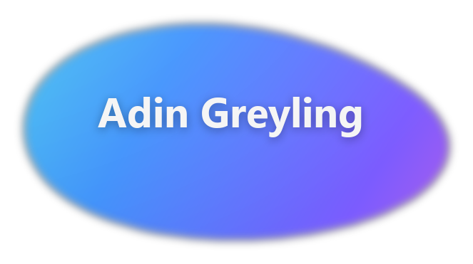

### Software Engineering student · Belgium Campus iTversity

Stellenbosch, Western Cape · vacation work and a 2027 workplace placement

  
  
  
  

**+27 60 819 9426** · [adin@lakeview.co.za](mailto:adin@lakeview.co.za) · [github.com/AdinGreyling](https://github.com/AdinGreyling) · [linkedin.com/in/adin-greyling](https://www.linkedin.com/in/adin-greyling-ba6688394/)

---

## Profile

3rd-year Software Engineering student at Belgium Campus iTversity in Stellenbosch. I build web apps and native Windows software, and I do freelance client work. Looking for vacation work and a 4th-year workplace placement in 2027 (in-service / AIT).

The [PDF](./Adin_Greyling_CV.pdf) is the file to send. This page is the same CV, laid out for GitHub.

---

## Education

**Bachelor of Computing, Software Engineering stream (NQF 8)** · 2024 – present  
Belgium Campus iTversity, Stellenbosch Campus

3rd year in 2026, expected completion 2027. The degree is three academic years plus a full fourth year of workplace training and a dissertation. Current modules include Software Engineering, Programming, Web Programming, Database Development, Machine Learning, Project Management and Research Methods.

Second-year average **75%**, with distinctions in Statistics (86%), Innovation & Leadership (85%), Mathematics (83%) and Information Systems (81%).

**BCom Information Technology (started)** · 2023  
Stellenbosch University

Started a BCom in IT, then transferred to Belgium Campus for a more practical, code-focused software engineering programme.

**National Senior Certificate** · 2022  
Midstream College, Pretoria

Bachelor's degree admission pass. Computer Applications Technology 81%, English 81%, Information Technology 74%.

---

## Technical skills

**Languages**

**Web**

**Systems and tools**

---

## Experience and projects

**Independent project — Pure Optimizer** · Jun 2026 – present  
[pureoptimizer.com](https://www.pureoptimizer.com)

- Windows tuner with one-click profiles for gaming, creative work, Office and low-end PCs, plus rollback, GPU and startup tools.
- Storefront and admin in Next.js, React, TypeScript and Supabase, with license keys, subscription durations and reseller tooling.
- Native C++ Windows client (DirectX 11 / ImGui) for login, HWID-bound keys, and authenticated download of the optimizer.
- Built and run the full stack next to my studies: web app, desktop client, licensing and support.

**Web developer — JW Wellness (freelance)**  
[jw-wellness.net](https://jw-wellness.net)

- Live website for a registered wellness counsellor: design, responsive layout and enquiry flow.

**Campus work**

- [SuperheroDatabaseSystem](https://github.com/AdinGreyling/SuperheroDatabaseSystem) — C# database system
- [MLG382-CYO-Project-2026](https://github.com/AdinGreyling/MLG382-CYO-Project-2026) — Machine learning, Python
- [MLG382-Guided-Project-2026](https://github.com/AdinGreyling/MLG382-Guided-Project-2026) — Machine learning, Python
- [SEN381](https://github.com/AdinGreyling/SEN381) — Software Engineering 381

---

## Additional

Afrikaans (home language) · English (fluent)

Mountain biking, surfing, coffee

References available on request.

